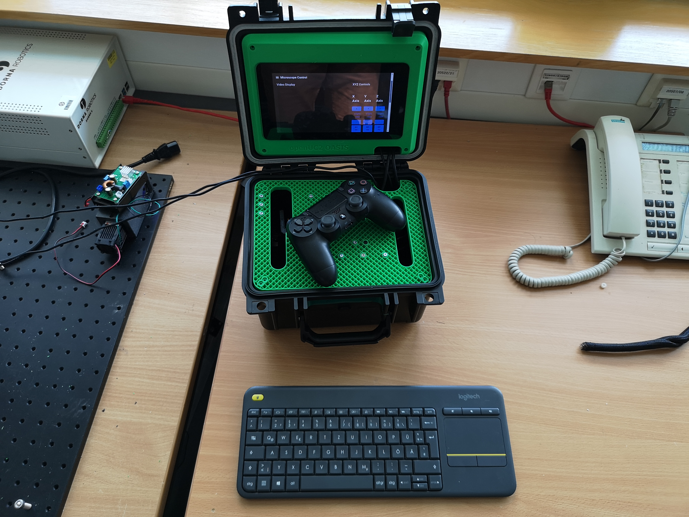

# Einleitung

Bei **openUC2** verfolgen wir das Ziel, Mikroskopie durch einen Open-Source-Ansatz einer breiten Öffentlichkeit zugänglich zu machen. Unser Fokus liegt darauf, eine große Bandbreite an Nutzern zu erreichen und gleichzeitig wirtschaftliche Effizienz zu gewährleisten. Um dieses Gleichgewicht zu erreichen, setzen wir ausschließlich auf Open-Source-Systeme. In Zusammenarbeit mit dem **Helmholtz-Institut Hereon** haben wir einen Prototyp entwickelt, der die Prinzipien der **Flow-Stop-Mikroskopie** nutzt. Dabei handelt es sich um ein System, das autonom auf einem Boot betrieben werden kann und es ermöglicht, Flüssigkeiten kontinuierlich durch den Fokus eines Mikroskopobjektivs zu leiten.

Der Prototyp wurde zunächst unter Verwendung der **openUC2 Cubes** in einem kleinen Experiment getestet. Dabei wurde schnell klar, dass für den produktiven Einsatz ein robusteres Design erforderlich ist, um den schwierigen Bedingungen auf einem Boot (wie Schwankungen und Feuchtigkeit) standzuhalten. Aufbauend auf den gewonnenen Erkenntnissen entwickelten wir ein modulares, 3D-druckbares System, das über eine **professionelle USB 3 Kamera mit Autofokus-System** verfügt. Eine kleine **peristaltische Pumpe** sorgt für den kontinuierlichen Flüssigkeitsstrom durch den Fokus der **Flusszelle**, während eine leistungsstarke LED das zu beobachtende Probenmaterial beleuchtet. Dies ermöglicht eine Auflösung von ca. **3-5 µm**.

### Projektüberblick

Das **OASIS-Mikroskop** wurde speziell dafür entwickelt, kontinuierlich Wasserproben durch den Fokus eines Mikroskops zu leiten und dabei automatisch Bilder aufzunehmen. Es ist sowohl für den Einsatz auf einem Boot als auch für stationäre Anwendungen in Laborumgebungen geeignet, wie etwa in einer Forschungsstation. Das Mikroskop ist in einer robusten, kompakten Kiste untergebracht, die sämtliche Elektronik, Motoren, Optik und Kamera beinhaltet und somit auch für den Einsatz unter raueren Umgebungsbedingungen vorbereitet ist.

Das Hauptziel des OASIS-Mikroskops besteht darin, bestehende Systeme wie beispielsweise die **Ferrybox** zu ergänzen. Dieses Mikroskop ermöglicht es, neben Parametern wie Wassertemperatur, pH-Wert und Sauerstoffgehalt auch die morphologische Untersuchung von Wasserinhaltsstoffen durchzuführen, beispielsweise Planktonzellen und andere Mikroorganismen. Dazu verwenden wir ein **10-fach-Mikroskopobjektiv**, das in Kombination mit der integrierten Kamera eine Auflösung von etwa 2-3 µm über ein Gesichtsfeld von ca. 3 x 4 mm ermöglicht.

Ein besonderes Merkmal des Systems ist die **eigenständige peristaltische Pumpe**, die unabhängig von externen Durchflusssystemen arbeitet und den Wasserfluss präzise kontrolliert. Der Wasserfluss erfolgt durch eine hochwertige **Durchflusszelle** der Firma IBD, die für eine exzellente optische Qualität sorgt. Eine **LED-Lichtquelle** sorgt für die notwendige Transmissionsbeleuchtung, die durch einen flexiblen Scharniermechanismus auch in einen schrägen Winkel gekippt werden kann, um eine Pseudo-Dunkelfeldbeleuchtung zu ermöglichen. Dadurch lassen sich zusätzlich gestreute Lichtinformationen erfassen, was insbesondere für die Untersuchung von Plankton nützlich ist.

Die Steuerung der Kamera, der Motoren für die Fokusbewegung sowie der Pumpe erfolgt durch einen **Raspberry Pi**. Dieser kleine Computer steuert alle Komponenten über die eigens entwickelte **ImSwitch-Software**, die für die Bildaufnahme und die synchronisierte Steuerung des gesamten Systems verantwortlich ist. Das Gerät kann vollständig autonom betrieben werden: Es führt den **Flow-Stop-Modus** durch, bei dem ein bestimmtes Wasservolumen in den Fokus gepumpt, der Durchfluss gestoppt und ein Bild aufgenommen wird, bevor der Prozess wiederholt wird. Alternativ ist es möglich, kontinuierliche **Videoaufnahmen** zu machen, um zeitlich umfangreichere Daten zu sammeln, beispielsweise während einer längeren Ozeanexpedition, um Informationen über das im Meer vorhandene Plankton zu gewinnen.

Das OASIS-Mikroskop verfügt zudem über ein integriertes **Touchscreen-Display**, das den Desktop des Raspberry Pi anzeigt. Über die benutzerfreundliche Touchscreen-Oberfläche können der Live-View des Mikroskops verfolgt sowie die Motoren und die Pumpe gesteuert werden. Zusätzlich lassen sich über das Interface alle wichtigen Einstellungen für den Flow-Stop-Betrieb vornehmen und das Experiment starten oder stoppen.

Wichtig zu beachten ist, dass das Gerät **nicht vollständig spritzwassergeschützt** ist, da zur Kühlung Öffnungen in das Gehäuse integriert werden mussten. Die Bauanleitung und der Entwicklungsprozess des Mikroskops sind öffentlich zugänglich und können unter folgendem Link eingesehen werden: [https://github.com/openUC2/openUC2_SOOP/](https://github.com/openUC2/openUC2_SOOP/)

#### **Komponentenübersicht**

Das OASIS-Mikroskop besteht aus einer Vielzahl von mechanischen und elektronischen Komponenten, die präzise aufeinander abgestimmt sind, um eine robuste und zuverlässige Funktionalität zu gewährleisten. Im Folgenden sind die Hauptkomponenten des Systems aufgeführt:

- **3D-gedruckte Bauteile**:
   Die Struktur des Mikroskops wird durch mehrere 3D-gedruckte Bauteile zusammengehalten. Diese Bauteile dienen der Befestigung der Optiken, mechanischen Elemente und Motoren. Das Gehäuse ist robust und spritzwassergeschützt gestaltet, bietet jedoch aufgrund der Lüftungsöffnungen keinen vollständigen Schutz vor Feuchtigkeit.

- **Optische Komponenten**:
   - **Objektiv**: Ein 10-fach-Mikroskopobjektiv, das zusammen mit der Kamera eine Auflösung von 2-3 µm bei einem Sichtfeld von ca. 3 x 4 mm erreicht. Dieses Objektiv dient der präzisen Fokussierung auf die Wasserproben.
   - **Kamera**: Die Kamera ist über eine Tubuslinse mit dem Objektiv verbunden und nimmt die Bilder der durch die Flusszelle fließenden Proben auf. Die Kamera ist über den **Raspberry Pi** gesteuert und synchronisiert mit den anderen Systemkomponenten.

- **Elektronische Komponenten**:
   - **Hauptplatine mit ESP32**: Diese Platine steuert die verschiedenen Motoren und die Beleuchtung über eine programmierte Firmware. Der ESP32 übernimmt die Motorsteuerung, während die Motoren über Motor-Treiber angesteuert werden.
   - **Nema 17 Schrittmotor**: Dieser Motor treibt die peristaltische Pumpe an, welche für den präzisen und kontrollierten Wasserfluss durch die Flusszelle sorgt.
   - **Mikroschrittmotor mit Schneckengetriebe**: Dieser Motor steuert den Fokusmechanismus des Mikroskops, indem er das Fotoobjektiv präzise bewegt. Durch das Schneckengetriebe wird eine hohe Präzision bei minimalen beweglichen Teilen erreicht, was die Zuverlässigkeit des Systems erhöht.
   - **Beleuchtungsplatine**: Eine speziell entwickelte Platine, die eine LED für die Transmissionsbeleuchtung steuert. Diese LED kann über einen Scharniermechanismus geneigt werden, um verschiedene Beleuchtungsmodi, wie Pseudo-Dunkelfeldbeleuchtung, zu ermöglichen.

- **Energieversorgung**:
   - **Abwärtswandler (Buck-Converter)**: Dieser Wandler konvertiert die 12V Eingangsspannung in 5V für die Versorgung des Raspberry Pi und des Displays. Der Abwärtswandler stellt sicher, dass alle Komponenten die benötigte Spannung erhalten, ohne Überhitzung oder Stromschwankungen zu verursachen.
   - **Raspberry Pi 5**: Der Raspberry Pi ist das zentrale Steuerelement des Mikroskops. Er ist direkt mit dem Display verbunden und ermöglicht die Steuerung der Kamera, Motoren und Pumpe. Über die ImSwitch-Software werden alle Komponenten synchronisiert.

- **Display**: Das 7-Zoll-Touchscreen-Display ist über die CSI-Schnittstelle mit dem Raspberry Pi verbunden. Es dient zur Anzeige der Benutzeroberfläche und ermöglicht die direkte Steuerung des Mikroskops.

#### **Zielgruppe und Nutzungsszenarien**

Das OASIS-Mikroskop richtet sich an eine spezialisierte Zielgruppe aus dem maritimen und ökologischen Forschungsbereich. Diese Zielgruppe umfasst:

1. **Meeresbiologen und Umweltforscher**:
   - Forscher, die an der Analyse von Gewässerproben interessiert sind, insbesondere an der Untersuchung von Partikeln, die eine Größe von 2-3 µm bis 500 µm aufweisen. Dies betrifft vor allem **Plankton**, **Phytoplankton** und andere Mikroorganismen, die wichtige Indikatoren für die Gesundheit von Meeresökosystemen darstellen.
   - Das Mikroskop eignet sich ideal für den Einsatz auf Forschungsschiffen oder in abgelegenen Laboren, da es in bestehende Systeme, wie die **Ferrybox**, integriert werden kann. Dies ermöglicht die gleichzeitige Analyse von physikalisch-chemischen Parametern wie Wassertemperatur, pH-Wert und Sauerstoffgehalt sowie die morphologische Untersuchung der Wasserinhalte.

2. **Technisch versierte Anwender**:
   - Die Zielgruppe umfasst Anwender mit technischem Verständnis, die in der Lage sind, potenzielle Fehlerquellen eigenständig zu erkennen und das Gerät gegebenenfalls sicher abzuschalten. Es wird vorausgesetzt, dass die Nutzer mit dem Betrieb von Mikroskopen, peristaltischen Pumpen und den Steuerungskomponenten eines Raspberry Pi vertraut sind.

3. **Bildungseinrichtungen und Klassenzimmer**:
   - Das Mikroskop kann auch in Bildungseinrichtungen, etwa in Schulen oder Universitäten, eingesetzt werden. Dort ermöglicht es Schülern und Studierenden den Zugang zu moderner Mikroskopietechnologie zur Untersuchung von Umweltproben. Wichtig ist hierbei, dass das Gerät unter Beaufsichtigung von geschultem Personal verwendet wird.

#### **Einschränkungen und Empfehlungen für die Nutzung**

Das OASIS-Mikroskop ist aufgrund der notwendigen Lüftungsöffnungen und der nicht vollständig geschützten Kabeldurchführungen nicht vollständig wasserdicht. Daher empfehlen wir, das Gerät nur in trockenen, gut kontrollierten Umgebungen einzusetzen. Es sollte **nicht** in Bereichen mit hoher Luftfeuchtigkeit oder direkter Wasserbelastung (z.B. Spritzwasser) verwendet werden.

Geeignete Anwendungsfälle umfassen:
- **Einsatz auf Booten**: Das Mikroskop kann in geschützten Bereichen auf Forschungsschiffen eingesetzt werden, solange es keinen direkten Kontakt mit Spritzwasser gibt.
- **Laboreinsatz**: Das Mikroskop eignet sich für den Einsatz in Laboren, insbesondere in Ökologie- oder Meeresbiologielaboren.
- **Bildungsumfeld**: In Klassenzimmern und Laboren, in denen Lehrende den sicheren Umgang mit dem Gerät gewährleisten können.

Das OASIS-Mikroskop bietet Forschern und Anwendern die Möglichkeit, **große Bilddatensätze** zu generieren, die beispielsweise für das Training neuronaler Netzwerke oder die Analyse der Zusammensetzung von Gewässerproben genutzt werden können.

#### Zweck

In der **Meeresbiologie** ist es von entscheidender Bedeutung, zu wissen, welche Organismen im Ozean vorkommen, wo sie sich befinden und zu welchen Zeiten sie auftreten. Vom **Hereon-Institut** wurde uns die Aufgabe übertragen, das **Plankton in den oberen Schichten des Ozeans** zu überwachen. Unser System lässt sich nahtlos in bestehende Box-Systeme von Kollegen in Jena integrieren, die für andere Anwendungen verwendet werden, jedoch grundlegende Funktionen wie die Wasserfiltration übernehmen.

Inspiriert durch das von französischen Kollegen entwickelte **Planktoscope** sowie ein Gerät, das von **Fairscope** vertrieben wird, soll unser Mikroskop einen Beitrag zur **Meeresforschung** leisten. Es liefert wertvolle Einblicke, wie sich Veränderungen der Meerestemperatur auf die Vegetation und die Nahrungsketten auswirken. Darüber hinaus kann unser Mikroskop potenziell dazu beitragen, das Verständnis darüber zu verbessern, wie Plankton die CO2-Bindungskapazität der Ozeane beeinflusst, die mit der Wassertemperatur verknüpft ist. Dieses aufstrebende Forschungsgebiet benötigt dringend neue Daten, und wir streben an, mit einer **kostengünstigen und gleichzeitig robusten Lösung** zur Generierung dieser Daten beizutragen.

#### Funktionen des OASIS-Mikroskops

1. **10x, 0.3NA Mikroskopobjektiv**:
   - Ein hochqualitatives Mikroskopobjektiv, das detaillierte Bildaufnahmen ermöglicht und speziell für die Untersuchung von Plankton und anderen Mikroorganismen entwickelt wurde. Mit einer numerischen Apertur von 0.3 bietet das Objektiv eine Auflösung, die es ermöglicht, Details im Submikrometerbereich zu erfassen.

2. **USB 3 Kamera**:
   - Die Kamera ist mit einem **Sony IMX 179 Chip** ausgestattet, der eine hohe Signal-Rausch-Verhältnis-Bildqualität (SNR) liefert. Dadurch können hochpräzise Bilder mit hoher Klarheit aufgenommen werden, die für wissenschaftliche Auswertungen geeignet sind.

3. **Peristaltische Pumpe (Nema 17 Schrittmotor)**:
   - Eine präzise gesteuerte peristaltische Pumpe, angetrieben durch einen **Nema 17 Schrittmotor**, ermöglicht den kontrollierten Flüssigkeitsfluss durch den Mikroskop-Fokus. Diese Pumpe kann unabhängig vom externen System betrieben werden und sorgt für eine konstante und regulierte Probenzufuhr.

4. **Motorisierter Fokus (Nema 11 Schrittmotor)**:
   - Der Fokus des Mikroskops wird durch einen **Nema 11 Schrittmotor** gesteuert, der eine CCTV-Linse verwendet, um präzise Fokusanpassungen vorzunehmen. Ein Schneckengetriebe ermöglicht die exakte Steuerung der Fokusebene. Diese mechanische Lösung reduziert die Anzahl der beweglichen Teile und sorgt für eine robuste und langlebige Konstruktion.

5. **Monolithisches, 3D-gedrucktes Gehäuse**:
   - Das gesamte Mikroskop ist in einem **monolithischen, 3D-gedruckten Gehäuse** untergebracht. Dieses Gehäuse integriert sowohl die motorisierten als auch die optischen Komponenten und sorgt für Stabilität und Schutz vor Umwelteinflüssen.

6. **openUC2-Elektronik**:
   - Die Elektronikplattform **openUC2** steuert die Motoren, die Beleuchtung und die peristaltische Pumpe. Die Steuerung erfolgt über eine eigens entwickelte **Firmware**, die auf einem **ESP32** basiert und die gesamte Gerätefunktionalität synchronisiert.

7. **Raspberry Pi 5**:
   - Der Raspberry Pi 5 fungiert als zentrales Steuerungselement für die Datenerfassung und die Geräteverwaltung. Die integrierte Software **ImSwitch** ermöglicht die Bildverarbeitung und die Steuerung aller Komponenten. Durch den Einsatz von **Python-Skripten** kann der Nutzer den Prozess individuell anpassen.

8. **IP66 Gehäuse**:
   - Das Mikroskop befindet sich in einem **IP66-geschützten Gehäuse**, das für den Einsatz in offenen Umgebungen, beispielsweise auf einem Boot, entwickelt wurde. Ein **7-Zoll-Touchscreen** dient zur Bedienung des Geräts, auch unter schwierigen Bedingungen wie Feuchtigkeit oder schwankenden Temperaturen.

9. **Wechselbare Flusszelle (IBiDi)**:
   - Die **Flow Cell** (Flusszelle), die von der Firma **IBiDi** bereitgestellt wird, ermöglicht flexible Experimente. Sie kann einfach gewechselt werden, um verschiedene Proben zu analysieren, was das Mikroskop zu einem vielseitigen Instrument für verschiedenste wissenschaftliche Studien macht.

10. **Interne Stromversorgung**:
    - Das Mikroskop wird über eine **12V Stromversorgung** betrieben. Ein integrierter Spannungswandler sorgt dafür, dass der Raspberry Pi und die anderen Komponenten die benötigten Spannungen (z.B. 5V) erhalten.

11. **WiFi Hotspot**:
    - Durch den integrierten **WiFi-Hotspot** kann das Mikroskop aus der Ferne gesteuert werden. Nutzer können sich über ein Smartphone, Tablet oder Laptop mit dem Gerät verbinden und alle Parameter überwachen und steuern.

#### *1. Title Page*
- *Product Name*: openUC2 OASIS v1
- *Model Number*: 2024.09.13_V1
- *Version*: 2024.09.24_V1, https://github.com/openUC2/openUC2_SOOP # a2d76b4, https://github.com/openUC2/ImSwitch/tree/master/imswitch # 4bae2d4
- *Manufacturer*: openUC2 GmbH, Hans-Knöll-Str. 6, 07745 Jena, Germany
- *Creation Date*: 13.09.2024

#### *2. Table of Contents*
- 1. Title Page
- 2. Table of Contents
- 3. Product Description
- 4. Declaration of Conformity
- 5. Risk Assessment and Analysis
- 6. Technical Drawings and Bill of Materials
- 7. Test Reports and Certificates
- 8. User Manual and Safety Instructions
- 9. Labels and Markings
- 10. Additional Documents (if required)
