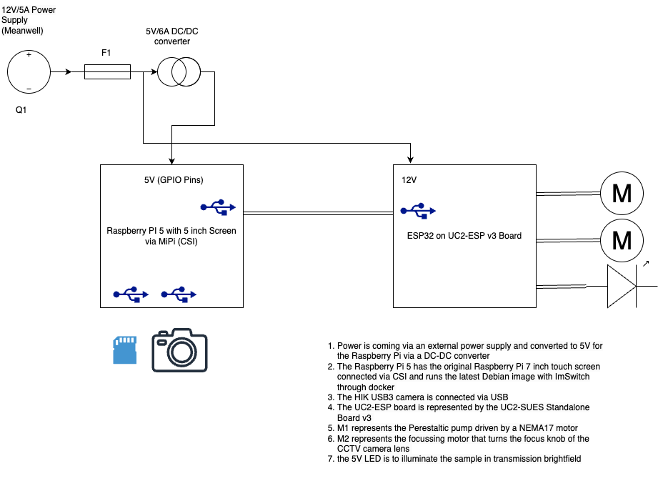

# Elektronischer Teil

Hier ist die vollständige und detaillierte Version des "Elektronischen Teils" mit allen technischen Spezifikationen für den **Raspberry Pi 5**, das **Netzteil**, das **Display** und die weiteren relevanten Komponenten innerhalb des OASIS Mikroskops.

Das OASIS-Mikroskop verwendet eine Kombination aus elektronischen Komponenten wie dem **Raspberry Pi 5**, einem **12V Netzteil**, einem **DC-DC Buck Converter** und zwei **Schrittmotoren**. Diese Komponenten sorgen zusammen für die präzise Steuerung der **Peristaltikpumpe**, des **Fokusmechanismus** und der **Kamera**. Mit der **7-Zoll-Touchscreen-Oberfläche** können Benutzer einfach und intuitiv mit dem Mikroskop interagieren. Das Design gewährleistet durch geeignete Schutzmaßnahmen, wie den Einsatz der **Littelfuse FHM Series Sicherung**, eine sichere und robuste Nutzung in anspruchsvollen Umgebungen wie der Meeresforschung oder ökologischen Untersuchungen.

### 3. **Schaltplan und Verkabelung**

#### **Elektrischer Schaltplan**
Der Schaltplan beschreibt die Topologie der elektrischen Verbindungen zwischen den verschiedenen Komponenten des OASIS-Mikroskops: **Raspberry Pi 5**, **ESP32**, **Motor-Treiber**, **Stromversorgung**, **Kamera** und **Beleuchtung**.

- **Stromversorgung**:
  - Die **12V Eingangsspannung** kommt von einem externen Netzteil (Mean Well PWM-60-12DA) und wird über eine Sicherung verteilt.
  - Ein **DC-DC Buck Converter** wandelt die 12V auf **5V** herunter, um den Raspberry Pi 5 und das Touchscreen-Display zu versorgen.
  - Die **openUC2 Steuerplatine** übernimmt die Spannungsregulierung für den ESP32 und die Motoren.

#### **Verkabelungsdiagramm**
Das Verkabelungsdiagramm zeigt die physischen Verbindungen zwischen den Komponenten:
- **Raspberry Pi 5**: Verbindungen zur Kamera, zum Touchscreen und zur Stromversorgung.
- **ESP32**: Verbindungen zu den Motor-Treibern und der Beleuchtung.
- **Motoren und Beleuchtung**: Verdrahtet mit der openUC2 Steuerplatine und gesteuert durch den ESP32.

#### **Stromverteilung**
Die **12V Eingangsspannung** wird im System folgendermaßen verteilt:
- **DC-DC Buck Converter**: Wandelt 12V auf **5V** für den Raspberry Pi und das Display.
- **openUC2 Steuerplatine**: Wandelt 12V auf **3,3V** und **5V** für die ESP32-Plattform und die Motoren.

#### **Leistungsaufnahme**
Die gesamte **Leistungsaufnahme** des Systems setzt sich aus den folgenden Komponenten zusammen:
- **Raspberry Pi 5**: Maximal bis zu **25W** bei **5V**.
- **Nema 17 Schrittmotor** für die Peristaltikpumpe: **12V**, 1,68A (ca. **20W**).
- **Mikroschrittmotor für den Fokus**: **12V**, 0,23A (ca. **2,76W**).
- **USB 3.0 Kamera**: Etwa **2-3W**.
- **LED-Beleuchtung**: **1-2W**.

**Gesamtleistungsaufnahme**: Etwa **30-35W**, wobei die größte Wärmeentwicklung vom Raspberry Pi ausgeht. Um die Wärme abzuleiten, gibt es Lüftungsschlitze am Gehäuse.

### **Technische Daten**

#### **Raspberry Pi 5**
Der **Raspberry Pi 5** ist das zentrale Steuerungselement des Mikroskops und steuert alle wichtigen Komponenten wie die Kamera, die Motoren und die Benutzeroberfläche.

- **Prozessor**: Quad-Core ARM Cortex-A76 64-bit SoC @ **2,4GHz**.
- **Arbeitsspeicher**: **8GB** LPDDR4X-4267 SDRAM.
- **USB-Anschlüsse**: 2x **USB 3.0**, 2x **USB 2.0**.
- **Wi-Fi**: 802.11ac Wi-Fi (2,4 GHz/5,0 GHz).
- **Bluetooth**: Bluetooth 5.0/BLE.
- **Display-Anschlüsse**: 2x microHDMI (bis zu 4K @60fps).
- **Betriebssystem**: **Raspberry Pi OS** mit vorinstallierter **ImSwitch**-Software.
- **Stromversorgung**: **5V**, über USB Typ-C-Anschluss (maximaler Strom: **5A**).
- **GPIO**: 40 Pins.
- **Abmessungen**: 85mm x 56mm x 17mm.
- **Betriebstemperatur**: -40°C bis +85°C.

#### **Touchscreen-Display (7-Zoll)**
Das kapazitive **7-Zoll-Touchscreen-Display** ermöglicht die direkte Steuerung und Interaktion mit dem Mikroskop.

- **Displaygröße**: **7 Zoll** (17,8 cm).
- **Auflösung**: **800 x 480 Pixel**.
- **Touchscreen**: Kapazitiver 10-Finger-Touchscreen.
- **Verbindung**: Über den **DSI-Port** mit dem Raspberry Pi verbunden.
- **Stromversorgung**: Wird über das Adapterboard des Displays direkt vom Raspberry Pi versorgt.
- **Maße**: 194mm x 110mm x 20mm.
- **Sichtbarer Bereich**: 155mm x 86mm.

#### **Netzteil (Mean Well PWM-60-12DA)**
Das **Mean Well PWM-60-12DA** Netzteil versorgt das Mikroskop mit 12V und sorgt für eine stabile Spannungsversorgung der Komponenten.

- **Eingangsspannung**: **90V-305V AC** (universaler Eingang).
- **Ausgangsspannung**: **12V DC**.
- **Maximaler Ausgangsstrom**: **5A**.
- **Maximale Leistung**: **60W**.
- **Schutzart**: **IP67** (wasserdicht, staubdicht).
- **Betriebstemperatur**: -40°C bis +85°C.
- **Besonderheiten**: DALI-kompatibel, eingebauter PFC-Schaltkreis, geschützt gegen Kurzschluss, Überlast, Überspannung und Übertemperatur.

#### **DC-DC Buck Converter**
Der **DC-DC Buck Converter** wandelt die 12V vom Netzteil auf 5V herunter, um den Raspberry Pi und das Display zu versorgen.

- **Eingangsspannung**: **12V**.
- **Ausgangsspannung**: **5V**.
- **Maximaler Ausgangsstrom**: **6A**.
- **Schutzfunktionen**: Überstromschutz, Überspannungsschutz, Übertemperaturschutz.
- **Betriebstemperatur**: -40°C bis +80°C.

#### **Schrittmotor für die Pumpe (Nema 17)**
Der **SY47STH47-1684A** (Nema 17) wird für die Peristaltikpumpe verwendet, um den Flüssigkeitsfluss präzise zu steuern.

- **Schrittwinkel**: **1,8°**.
- **Nennspannung**: **2,8V**.
- **Nennstrom**: **1,68A**.
- **Haltemoment**: **4,4 kg/cm**.
- **Wellendurchmesser**: **5 mm**.

#### **Schrittmotor für den Fokus**
Der **Micro 15mm DC 12V Schrittmotor** wird für die Fokussierung verwendet und bietet präzise Steuerung durch ein Getriebe.

- **Betriebsspannung**: **12V**.
- **Stromaufnahme**: **0,23A**.
- **Anwendung**: Treibt den Fokusring des Überwachungskamera-Objektivs an.

#### **Sicherung (Littelfuse MINI® FHM Series)**
Die **Littelfuse FHM Series** bietet einen **IP67-Schutz** und ist ideal für den maritimen oder rauen Einsatz. Sie schützt das System vor Überlastungen und Kurzschlüssen.

- **Nennstrom**: **5A**.
- **Nennspannung**: **32V DC**.
- **Schutzart**: **IP67**.
- **Anwendung**: Schützt das Mikroskop-System und die angeschlossenen Komponenten.
