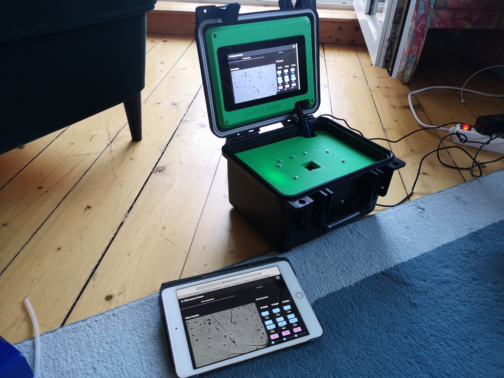
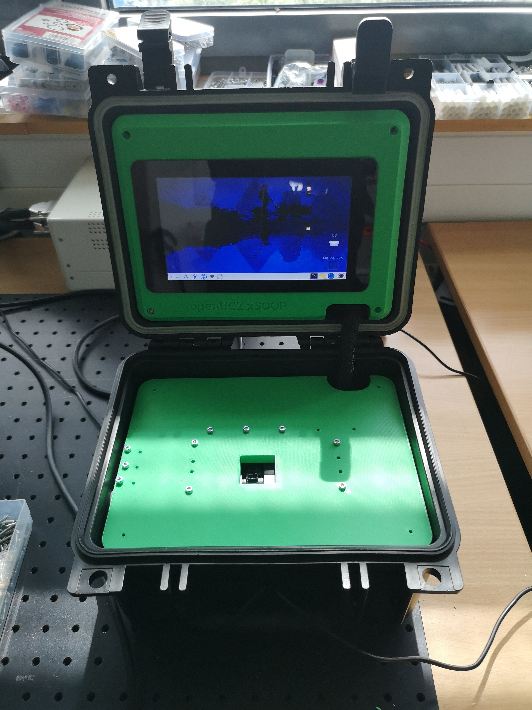

## Project Title: openUC2 SOOP Microscope

### 1. Introduction

#### Overview
At openUC2, our goal is to make microscopy accessible to a broad audience through an open-source approach. While we aim to serve a wide range of users, we also strive to maintain economic viability. To achieve this balance, we rely entirely on open-source systems. In collaboration with the Helmholtz Institute Hereon, we have developed a prototype that embodies the principles of flow-stop microscopy, creating a flow apparatus that can autonomously operate on a boat, allowing liquids to pass continuously through the focus of a microscope objective. Initially, the prototype was built using openUC2 cubes and tested in a small-scale experiment. It became apparent that for productive use, a more robust design was needed to withstand the challenging conditions on a boat, such as fluctuations and humidity. Leveraging insights from the modular design, we created a robust, modular 3D-printable setup featuring a professional USB 3 camera with an autofocus system. A small peristaltic pump ensures continuous flow through a flow cell's focus, and a strong LED illuminates the sample, achieving a resolution of approximately 3-5 µm.



#### Purpose
In marine biology, it is crucial to know what organisms are present in the ocean, where they are located, and when they appear. We were tasked by the Hereon Institute to monitor plankton in the upper layers of the ocean. Our system integrates with existing box systems from colleagues in Jena, which, although used for different applications, perform essential functions such as water filtration. Inspired by the planktoscope developed by French colleagues and the device distributed by Fairscope, our microscope aims to contribute to ocean research. It provides insights into how ocean temperature changes affect vegetation and food chains, and potentially how plankton influences the ocean's CO2 binding capacity, which is linked to water temperature. This emerging field of research urgently requires new data, and we aim to deliver a cost-effective yet robust solution to generate this data.

#### Features
- **10x, 0.3NA Microscope objecitve**: High-quality objective lens for detailed imaging.
- **USB 3 Camera**: Equipped with a Sony IMX 179 chip for high SNR image quality.
- **Peristaltic Pump**: Nema 17 driven for precise flow through the focus of the microscope.
- **Motorized Focus**: Nema 11 driven with a CCTV lens for precise adjustments. We use a wormdrive on the CCTV lens's focus
- **Monolithic 3D-Printed Body**: Durable and integrates all motorized and optical components.
- **openUC2 Electronics**: Controls for motors and lighting.
- **Raspberry Pi 5**: Manages data acquisition and device control with image processing software.
- **IP66 Case**: Duralbe with a 7-inch touch screen for control in open conditions (e.g. on a boat)
- **Interchangeable Flow Cell**: Provided by IBiDi for flexibility in experiments.
- **Internal Power Supply**: Supports 12V operations.
- **WiFi Hotspot**: Allows remote connection and control via smartphone or tablet.


### 2. Table of Contents
- Introduction
- Getting Started
- Assembly and Setup
- Operation Instructions
- Troubleshooting
- Maintenance and Safety
- 3D Printing Files
- Software Configuration
- FAQ
- Contributions
- License
- Contact Information

### 3. Getting Started

This is a high-level set of instructions assuming you have a ready-to-work device right in front of you.



#### Prerequisites
- **Required Hardware**:
  - A 12V power supply
  - silicone tubing with an outer diameter of 5 mm and an inner diameter of 3.5 mm
- **Required Software**:
  - Raspberry Pi OS (Debian-based)
  - Docker
  - ADditional information here: [Docker Container for ImSwitch](https://github.com/openUC2/ImSwitchDockerInstall) and [Setup Raspi For Docker + ImSwitch](https://github.com/openUC2/ImSwitchDockerInstall/blob/master/launch_imswitch_raspi.md)

When you have the black box labeled openUC2 (Pellican-like) in front of you, open the locking levers at the front, near the handle, to flip open the lid, which is hinged. Inside the lid, you'll find a 7-inch Raspberry Pi display used for controlling the device with ImSwitch software, which enables continuous flow-stop microscopy with a camera. The device runs a standard Raspberry Pi image based on Debian. On the back, you'll find various ports for network, USB, and power connections.

To power the device:
1. Plug the 12V power supply into an outlet.
2. Connect it to the 12V power jack on the back of the device.

When powered on, both the Raspberry Pi and the stepper motor and lighting electronics will be activated. Inside the housing, a DC-DC converter adjusts the 12V to 5V to power the Raspberry Pi and Wi-Fi adapter. Once the Raspberry Pi boots, you'll see the desktop, and after a short while, a browser will launch, displaying the black ImSwitch interface. This interface shows a live stream and various buttons for hardware control. In the top tab, you can start and monitor the flow-stop process. On the back, you'll also find the inlets and outlets for the microfluidic system, currently using silicone tubing, which can be connected to existing systems like the Ferrybox. The microscope operates by using a peristaltic pump to alternate flow into the microscope's field of view, pausing to capture images, and repeating the process as needed.

#### Installation
To install the necessary software and drivers:

1. **Install Docker on the Raspberry Pi**:
   - Follow the [official Docker installation guide for Raspberry Pi](https://docs.docker.com/engine/install/debian/).

2. **Download the ImSwitch Docker image**:
   - Pull the ImSwitch Docker image from the repository: `docker pull openuc2/imswitch`.

3. **Set up the ImSwitch configuration**:
   - Download the ImSwitch configuration files from the openUC2 repository: `https://github.com/openUC2/ImSwitchDockerInstall`.
   - Read through the docs to setup the service and let it startup automatically https://github.com/openUC2/ImSwitchDockerInstall/blob/master/launch_imswitch_raspi.md
   - Check if the camera is mounted correctly by typing `sudo lsusb`, you should see something like HIK
   - Ensure the browser opens the ImSwitch interface on boot.

4. **Access the ImSwitch web interface**:
   - ImSwitch server can be accessed at: `https://localhost:8001/docs`.
   - The React app for streaming and hardware control is available at: `https://localhost:8001/imswitch/index.html`.

5. **Wi-Fi Setup**:
   - Configure the Raspberry Pi to connect to a Wi-Fi network with the following credentials:
     - **SSID**: Blynk
     - **Password**: 12345678
   - This can be done via a mobile hotspot or the included Wi-Fi adapter. Replace `localhost` with the device's IP address when accessing remotely, for example: `https://192.168.1.102/docs`.


**ATTENTION**: The external Hardrives Name must not contain any empty spaces!!!

#### Quick Start Guide
To get the microscope running for the first time:


1. **Power On**:
   - Connect the 12V power supply and turn on the device.

2. **Start the Live Stream**:
   - Once the interface is visible, click the "Play" button to start the live stream.
   - The camera's current view will be displayed.

3. **Control the Flow**:
   - Use the "X+" and "X-" buttons to start the peristaltic pump, moving water through the microscope's field of view.
   - Adjust the focus using the "Z+" and "Z-" buttons.

4. **Configure Flow-Stop**:
   - Navigate to the settings tab to adjust experiment parameters.
   - Press "Automatic Start" to begin continuous water flow and image capture.

5. **Save Images**:
   - If configured, images will be saved to an external device connected via Docker mounts. Manual configuration of the exact drive name is required initially.

6. **Shutdown and Pack**:
   - Use a keyboard to put the device into standby or shutdown mode.
   - Ensure the device is clean and dry before closing the case for the next use.


### 4. Assembly and Setup
- **Hardware Assembly**: Detailed instructions, with diagrams or photos, on how to assemble the microscope.
- **Initial Setup**: How to connect the microscope to a computer and configure initial settings.
- **Calibration**: Instructions on how to calibrate the microscope for accurate measurements.


### 5. Operation Instructions
- **Basic Operation**: How to use the microscope for standard tasks.
- **Advanced Operation**: Detailed instructions on using advanced features.
- **Sample Preparation**: Guidelines on how to prepare samples for observation.

### 6. Troubleshooting
- **Common Issues**: List of common problems and their solutions.
- **Error Codes**: Explanation of any error codes the device might display.
- **Support**: How to seek additional help if problems persist.

### 7. Maintenance and Safety
- **Regular Maintenance**: Instructions on how to maintain the microscope for optimal performance.
- **Cleaning**: How to properly clean the microscope components.
- **Safety Precautions**: List of safety measures to prevent damage to the microscope and ensure user safety.

### 8. 3D Printing Files
- **File Repository**: Link to the folder containing 3D printing files.
- **Replacement Parts**: List of parts that can be 3D printed.
- **Printing Instructions**: Guidelines on how to print and replace parts.

### 9. Software Configuration
- **Software List**: List of required software with download links.
- **Configuration Guide**: Step-by-step instructions to configure the software for optimal performance.
- **Update Instructions**: How to update the software when new versions are released.

```json
{
    "wasRunning": true,
    "defaultFlowRate": 100,
    "defaultNumberOfFrames": -1,
    "defaultExperimentName": "FlowStopExperiment",
    "defaultFrameRate": 1,
    "defaultSavePath": "./",
    "defaultFileFormat": "JPG",
    "defaultAxisFlow": "A",
    "defaultAxisFocus": "Z",
    "defaultDelayTimeAfterRestart": 1
}
```


https://github.com/openUC2/ImSwitchDockerInstall


##### ImSwitch GUI

https://github.com/openUC2/ImSwitch/blob/master/imswitch/imcontrol/view/widgets/FlowStopWidget.py

#### ImSwitch Controller

https://github.com/openUC2/ImSwitch/blob/master/imswitch/imcontrol/controller/controllers/FlowStopController.py

#### ImSwitch Sharing of variables

https://github.com/openUC2/ImSwitch/blob/master/imswitch/imcontrol/model/managers/FlowStopManager.py


### 10. FAQ
- **Frequently Asked Questions**: A list of common questions and answers related to the microscope.

### 11. Contributions
- **How to Contribute**: Guidelines for contributing to the project.
- **Code of Conduct**: Expected behavior when contributing to the project.
- **Issue Reporting**: How to report issues or suggest improvements.

### 12. License
- Hardware runs under CERN OHL v1.2
- **ATTENTION**: Absolutely no liability for anything that is documented here!
- Software runs under GPLv3 as of now and MIT
- IMAGES_Assembly: CC-BY-NC


### 13. Contact Information
- **Support Contact**: Contact details for further support.
- **Community Links**: Links to forums or groups related to the microscope.

### 14. Legacy Devices


